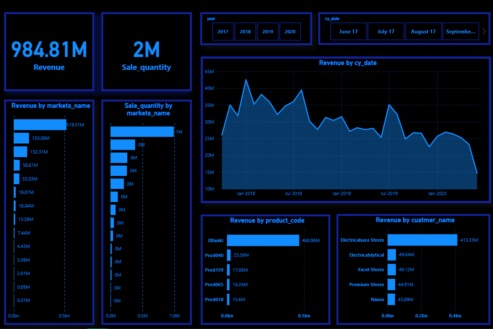

# Sales Analysis Dashboard

## Project Overview
This Sales Analysis Dashboard provides a comprehensive visualization of sales performance across different markets, products, and customers over time. It includes key metrics such as total revenue, sales quantities, and detailed breakdowns by market, product code, and customer. The dashboard is designed to give a clear picture of how sales trends evolve and to help businesses identify top-performing markets and customers.

## Key Features
- **Total Revenue**: Displays the total revenue generated, currently $984.81M.
- **Sales Quantity**: Shows the total quantity of products sold, which is 2M units.
- **Revenue by Market**: A bar chart visualizing the revenue generated by different markets. The largest contributor to revenue is the top market with $519.51M.
- **Sales Quantity by Market**: Provides insights into the number of units sold in each market, with one market dominating with 1M units sold.
- **Revenue by Product**: A breakdown of revenue by product code. A significant portion is classified as “Blank,” which may indicate missing or unclassified product data.
- **Revenue by Customer**: Displays the revenue contributed by different customers. Electricalsara Stores is the top customer, contributing $413.33M in revenue.
- **Time-Based Revenue Analysis**: A line graph shows revenue trends over time, highlighting peak performance periods and declines. The chart spans from January 2018 to early 2020.
- **Interactive Filters**: 
  - Year filter (2017 - 2020) allows users to focus on specific time periods.
  - Date filter to zoom into specific months for detailed analysis.

## File Structure
The dashboard project consists of the following files and folders:
- `dashboard.pbix`: The Power BI or BI tool file containing the sales dashboard.
- `README.md`: Documentation file (this file).
- `data/`: Folder containing source sales data (if applicable).
- `images/`: Folder for any relevant screenshots of the dashboard (optional).

## How to Use
1. **Open the Dashboard**: Use Power BI or another compatible BI tool to open the `dashboard.pbix` file.
2. **Interact with Filters**: Explore the data by using the filters for year and date to focus on specific periods.
3. **Analyze the Data**:
   - Check overall revenue and sales quantity.
   - Investigate the performance of specific markets, customers, or products.
   - Identify peak and low periods of revenue from the time-based chart.

## Insights from the Dashboard
- **Market Performance**: One market significantly outperforms others in both revenue and sales quantity.
- **Customer Insights**: The largest customer, Electricalsara Stores, contributes the most to total revenue, with smaller contributions from other customers.
- **Product Revenue**: Most of the revenue is from unclassified ("Blank") products, indicating potential data issues or uncategorized sales.
- **Revenue Trends**: Revenue shows peak periods in mid-2018 and mid-2019, with a decline toward the start of 2020.

## Requirements
- Power BI Desktop (or other compatible BI tool).
- Source data file (if not embedded within the dashboard file).

## Possible Improvements
- **Data Cleanup**: Address the "Blank" product category to ensure all products are correctly classified.
- **Market Expansion**: Focus on markets with lower sales quantities to potentially grow revenue in those areas.
- **Further Trend Analysis**: Investigate the cause of revenue decline in late 2019 to 2020 to take action on possible business challenges.

## License
This project is licensed under the MIT License - see the LICENSE.md file for details.
